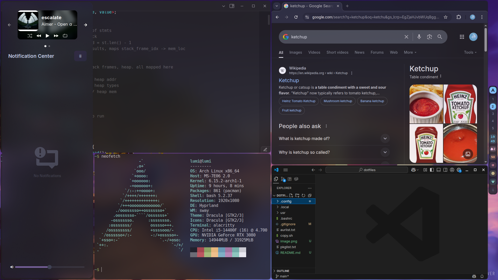

## Arch Linux + Hyprland configuration dot files

### Keybinds
- `SUPER + 1..5` switch workspaces
- `SUPER + A` open audio menu
- `SUPER + B` open bluetooth menu
- `SUPER + C` open vscode
- `SUPER + E` open file manager
- `SUPER + F` maximize
- `SUPER + G` open chrome
- `SUPER + J` toggle split
- `SUPER + M` open spotify
- `SUPER + N` open network menu
- `SUPER + O` open obsidian
- `SUPER + P` pseudo
- `SUPER + R` open app launcher
- `SUPER + S` toggle floating
- `SUPER + T` open terminal
- `SUPER + V` open clip history
- `SUPER + W` toggle waybar
- `SUPER + X` kill active window
- `SUPER + Y` open config files in vscode
- `SUPER + SHIFT + 1..5` move workspaces
- `SUPER + SHIFT + S` screenie
- `SUPER + ALT + 1..3` switch shaders `bright, contrast, vibrant`

### Waybar Features
- app launcher `LMB: open`
- switch workspaces `1..5`
- time `hover: show weekday/day/month`
- notifications `RMB: clear, MMB: toggle dnd`
- audio `LMB: open menu, scroll: ±5, RMB: mute`
- media `LMB: pause`
- monitor-brightness `LMB/MMB/RLB: 0/50/100%`
- wifi `LMB: open menu`
- bluetooth `LMB: open menu`